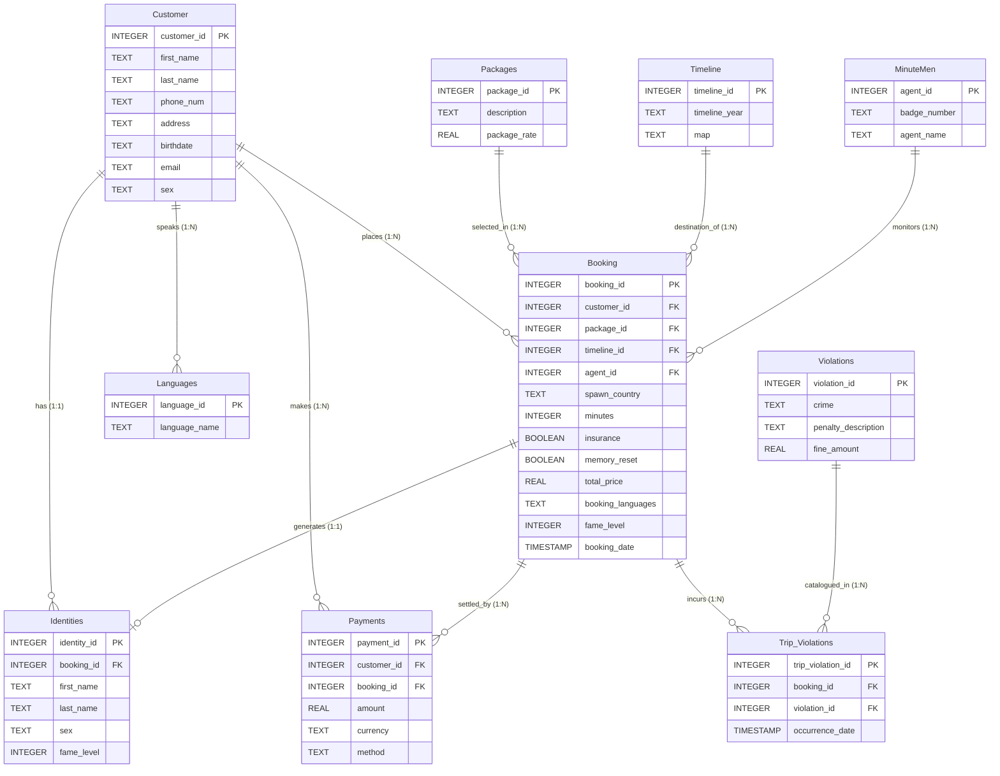

# Time Travel Database - Entity Relationship Diagram (ERD)

This diagram visualizes the complete database schema natively reflecting the current SQL setup. It displays all entities (tables), their attributes (columns) with data types, primary keys (PK), foreign keys (FK), and the cardinal relationships (one-to-many, one-to-one) between them.

### Cardinality Legend:
*   `||--o{` : **One-to-Many**. (e.g., One `Customer` can have zero or many `Bookings`).
*   `||--o|` : **One-to-One / Zero-to-One**. (e.g., One `Booking` can optionally generate one `Identity`).
*   `PK` : Primary Key (Unique identifier for the row).
*   `FK` : Foreign Key (Reference to another table's Primary Key).
