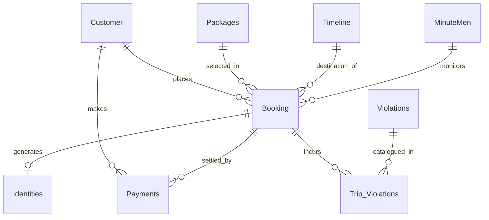

# Time Travel Database Architecture Report

## Overview
The Time Travel database (`time_travel.db`) is a robust relational database designed to manage interdimensional tourism. It securely handles customer identities, package pricing, historical timeline destinations, financial transactions, and compliance with the Time Travel Authority via the MinuteMen agents.

The core philosophy of the database is to maintain a central `Booking` hub that ties all related operational data together through structured **Primary Keys (PK)** and **Foreign Keys (FK)**, preventing data duplication and ensuring data integrity.

---

## The Central Hub: `Booking` Table
The `Booking` table is the analytical center of the database. Every time a customer purchases a trip, a single row is inserted here. Instead of storing the customer's name, the package description, the timeline name, and the assigned agent's name all in one massive table (which would cause massive data redundancy), the `Booking` table stores **Foreign Keys** that point to dedicated tables.

### Foreign Key Relationships in `Booking`
*   **`customer_id` (FK) ➝ `Customer` (PK)**: Links the booking to the real-world traveler's physical identity and billing info. One customer can have many bookings, but each booking belongs to exactly one customer.
*   **`package_id` (FK) ➝ `Packages` (PK)**: Links the trip to the specific tier purchased (Peasant, Quantum Query, or Monarch).
*   **`timeline_id` (FK) ➝ `Timeline` (PK)**: Links the trip to the era the customer is traveling to (e.g., "-65'000'000", "1940").
*   **`agent_id` (FK) ➝ `MinuteMen` (PK)**: Links the trip to the specific authoritative agent (e.g., "Agent K") randomly assigned to monitor the pruned timeline copy for paradoxes.

### Internal Attributes
The `Booking` table also holds trip-specific data that doesn't belong in shared tables:
*   `fame_level`: The specific social influence (1-5) purchased for this exact trip.
*   `booking_languages`: A comma-separated string of the `language_id`s the traveler requires to communicate in their destination.
*   `minutes`, `spawn_country`, `insurance`, `memory_reset`, `total_price`.

---

## Satellite Tables

### 1. The `Identities` Table (Timeline Aliases)
**Relationship: `booking_id` (FK) ➝ `Booking` (PK)**
When a customer purchases a high-tier package (Quantum Query or Monarch Mode), they are securely assigned a random, historically blending timeline alias (e.g., "Aldous Thorne") matched to their biological sex. 
*   **Why it's separate:** This ensures the timeline alias is cleanly separated from the real-world `Customer` table to protect the traveler's true identity from chronal infiltration. It binds directly to the specific `Booking` rather than the `Customer`, because a single customer might take 5 different trips and require 5 completely different aliases.

### 2. The `MinuteMen` Table (Agents)
**Relationship: `agent_id` (PK) referenced in `Booking` (FK)**
This table stores the roster of the 10 elite Time Travel Authority agents (e.g., "Agent Weaver", Badge "MM-009"). 
*   **Why it's separate:** If an agent's name changes or badge needs updating, the database only needs to update one single row in the `MinuteMen` table, and all thousands of `Booking` rows tied to that `agent_id` automatically reflect the change.

### 3. The `Packages` Table
**Relationship: `package_id` (PK) referenced in `Booking` (FK)**
Stores the 3 standard modes of travel.
*   **Why it's separate:** If the business decides to increase the *Monarch Mode* price from $50 to $100 per minute, you only update the single `package_rate` in the `Packages` table, preserving historical integrity without having to update thousands of old booking records.

### 4. The `Customer` Table
**Relationship: `customer_id` (PK) referenced in `Booking` and `Payments` (FKs)**
Stores the true biological and legal identity of the traveler (Real Name, Sex, Birthdate, Email). 

### 5. The `Payments` Table
**Relationship: `customer_id` (FK) ➝ `Customer` (PK)**
This handles financial transactions tied to a specific traveler.

---

## Standalone & Junction Tables

### 1. `Languages`
Contains ~100 distinct historical languages. It is queried by the application to populate the Streamlit dropdown, and the chosen combination of their `language_id`s is saved directly into the `booking_languages` text string in the `Booking` table.

### 2. `Violations` & `Trip_Violations`
The `Violations` table acts as a strict, read-only "Rulebook Catalog" for the MinuteMen. It defines catastrophic crimes (Murder, Genocide, Paradox Theft) and assigns predetermined financial and existential penalties.
*   **`Trip_Violations` (Junction Table)**: This table resolves the many-to-many relationship between `Booking` and `Violations`. When a customer is caught committing a crime, a row is inserted here linking the specific `booking_id` to the `violation_id`.

---

## Mermaid Schema Overview

