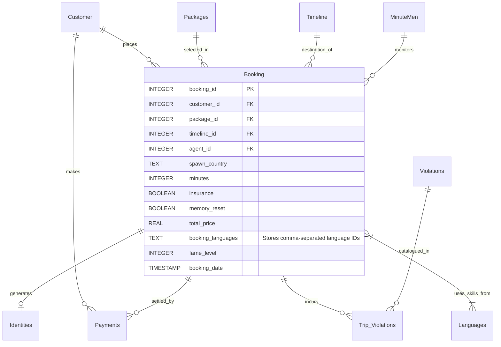

# Time Travel Database Schema

Here is the relational database graph representing the structure of `time_travel.db`, showing how the central `Booking` table acts as the hub connecting all surrounding tables.

*Note: For the full attribute details of all tables, please refer to the Entity-Relationship Diagram (`erd.md`) and the project report (`report-time-travel.md`).*
