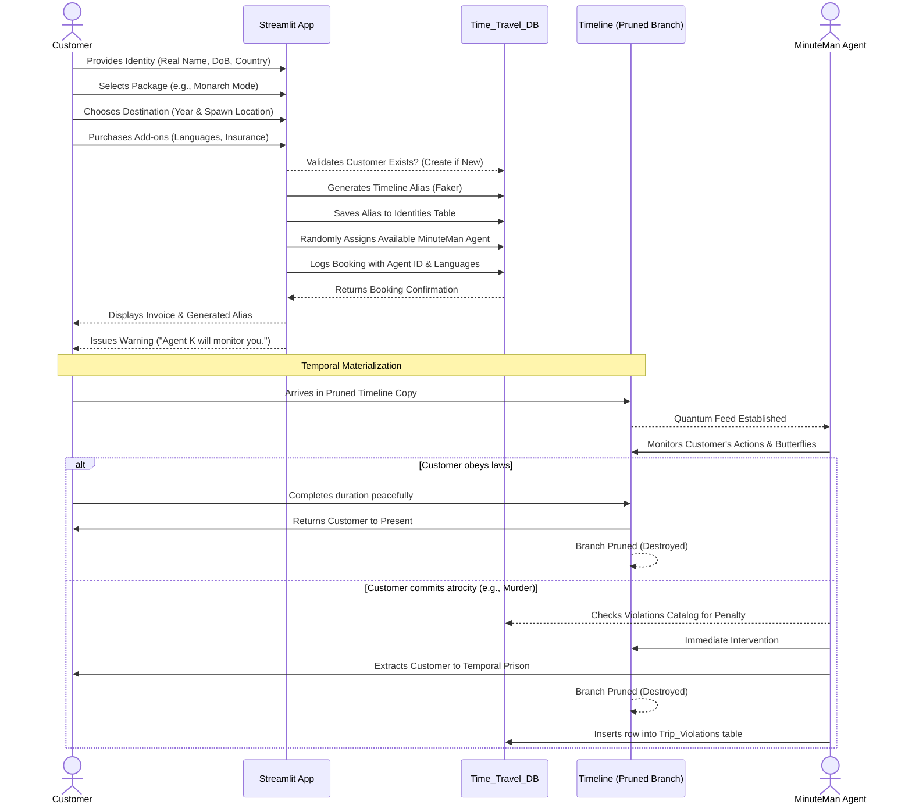

# Time Travel Business Flow

Here is the sequential flow of how your time travel business operates, from a customer booking a trip to a MinuteMan intervening in a timeline.

```mermaid
sequenceDiagram
    actor C as Customer
    participant A as Streamlit App
    participant DB as Time_Travel_DB
    participant TL as Timeline (Pruned Branch)
    actor M as MinuteMan Agent

    %% Pre-Booking Phase
    C->>A: Provides Identity (Real Name, DoB, Country)
    C->>A: Selects Package (e.g., Monarch Mode)
    C->>A: Chooses Destination (Year & Spawn Location)
    C->>A: Purchases Add-ons (Languages, Insurance)
    
    %% Booking Execution Phase
    A-->>DB: Validates Customer Exists? (Create if New)
    A->>DB: Generates Timeline Alias (Faker)
    A->>DB: Saves Alias to Identities Table
    A->>DB: Randomly Assigns Available MinuteMan Agent
    A->>DB: Logs Booking with Agent ID & Languages
    DB-->>A: Returns Booking Confirmation
    
    A-->>C: Displays Invoice & Generated Alias
    A-->>C: Issues Warning ("Agent K will monitor you.")

    %% The Actual Trip
    Note over C, TL: Temporal Materialization
    C->>TL: Arrives in Pruned Timeline Copy
    TL-->>M: Quantum Feed Established
    M->>TL: Monitors Customer's Actions & Butterflies

    %% Anomaly Event
    alt Customer obeys laws
        C->>TL: Completes duration peacefully
        TL->>C: Returns Customer to Present
        TL-->>TL: Branch Pruned (Destroyed)
    else Customer commits atrocity (e.g., Murder)
        M-->>DB: Checks Violations Catalog for Penalty
        M->>TL: Immediate Intervention
        M->>C: Extracts Customer to Temporal Prison
        TL-->>TL: Branch Pruned (Destroyed)
        M->>DB: Inserts row into Trip_Violations table
    end
```
